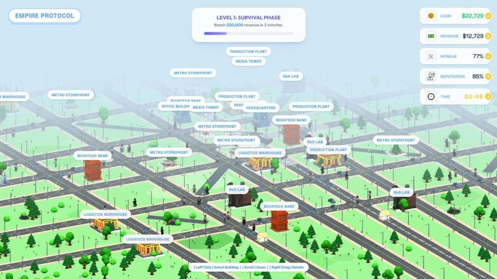
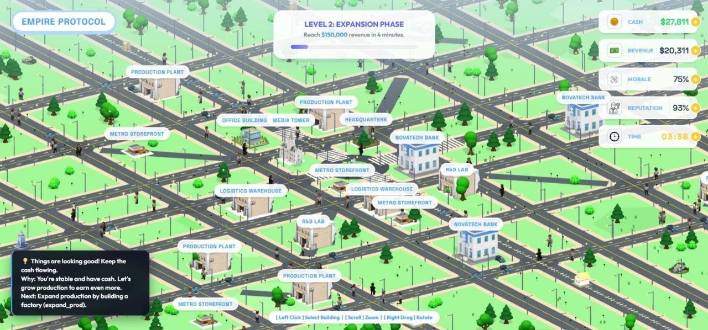
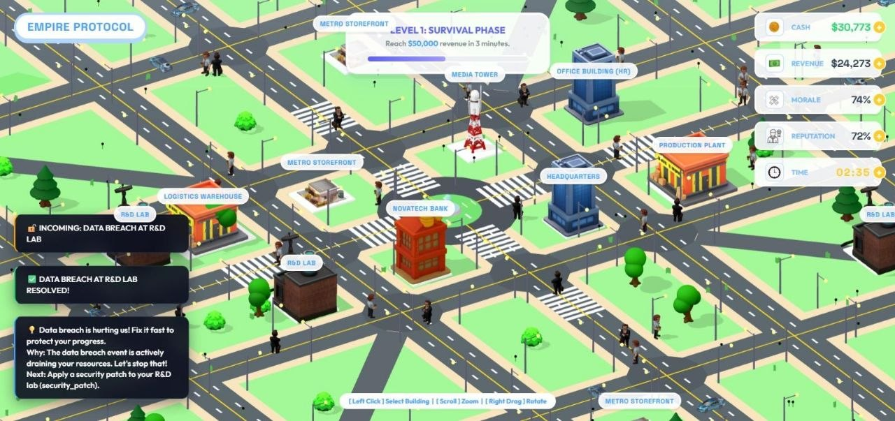
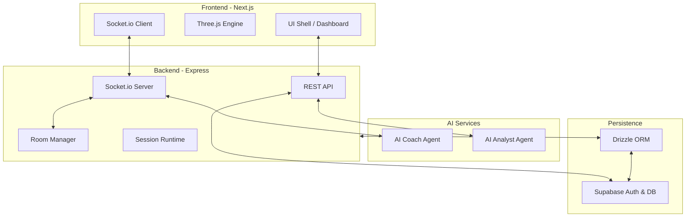
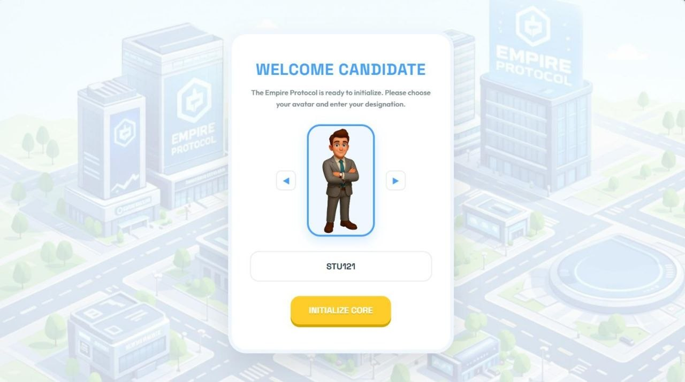
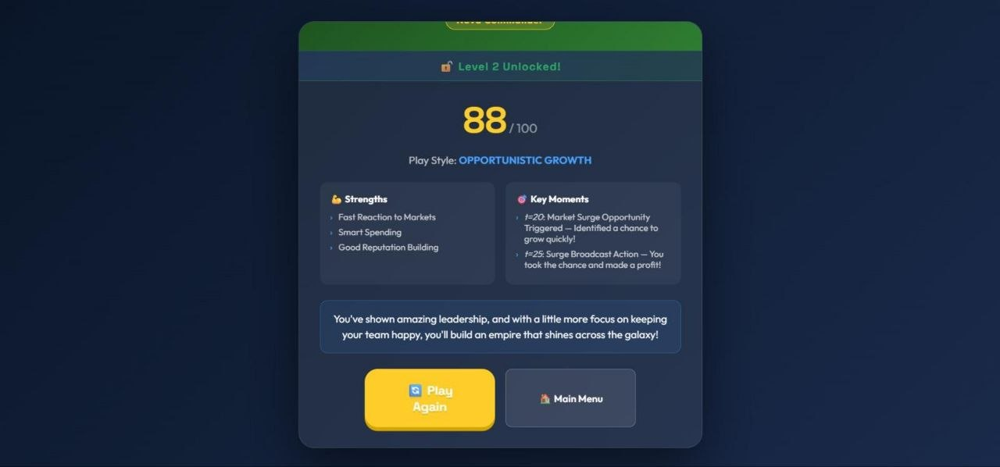

# 👑 Empire Protocol

**Empire Protocol** is a high-fidelity, real-time multiplayer gaming platform featuring AI-driven dynamic challenges and gameplay insights. Built for high performance and deep immersion, it combines 3D graphics, real-time strategy, and intelligent coaching.



## 🚀 Overview

This monorepo contains a unified ecosystem for multiple games (Cognitive & Finance) sharing a single high-performance backend.

- **Unified Dashboard:** Central hub for user profiles, AI summaries, and progression.
- **Battleground:** Real-time multiplayer room system for competitive play.
- **AI Integration:** Powered by Google Gemini and OpenAI to provide real-time coaching tips and post-game analytical summaries.
- **State Discovery:** Road-map style level progression (Levels 1-5).

---



## 🏗️ Architecture



---

## 🛠️ Tech Stack

### Frontend
- **Framework:** [Next.js](https://nextjs.org/) (App Router)
- **3D Graphics:** [Three.js](https://threejs.org/)
- **Animations:** [GSAP](https://greensock.com/gsap/)
- **State Management:** React Context + Real-time Socket Synchronization
- **Styling:** Vanilla CSS / Tailwind (where applicable)

### Backend
- **Server:** [Express.js](https://expressjs.com/)
- **Real-time:** [Socket.io](https://socket.io/) / [ws](https://github.com/websockets/ws)
- **Database:** [PostgreSQL](https://www.postgresql.org/) (via [Supabase](https://supabase.com/))
- **ORM:** [Drizzle ORM](https://orm.drizzle.team/)
- **AI:** [Google Generative AI](https://ai.google.dev/) (Gemma) & [OpenAI](https://openai.com/)

---


## 📥 Getting Started

### Prerequisites
- **Node.js 20+**
- **Supabase Project** (Database + Auth enabled)

### Environment Setup

1. **Frontend:**
   ```bash
   cp frontend/.env.local.example frontend/.env.local
   # Fill in:
   # NEXT_PUBLIC_SUPABASE_URL
   # NEXT_PUBLIC_SUPABASE_ANON_KEY
   ```

2. **Backend:**
   ```bash
   cp backend/.env.example backend/.env
   # Fill in:
   # SUPABASE_URL
   # SUPABASE_SERVICE_ROLE_KEY
   # DATABASE_URL
   # GEMINI_API_KEY / OPENAI_API_KEY
   ```

### Database Migrations
From the `backend/` directory:
```bash
npm run db:generate
npm run db:migrate
```

### Installation and Running
From the root directory:
```bash
# Install dependencies
npm install

# Run both Frontend & Backend
npm run dev
```

- **Frontend:** [http://localhost:3000](http://localhost:3000)
- **Backend Health:** [http://localhost:3001/api/health](http://localhost:3001/api/health)

---

## 🎮 Game Features

- **Real-time Multiplayer:** Create or join rooms in the Battleground using secret codes.
- **AI Coach:** Receives live game state updates and provides strategic tips every 20-30 seconds.
- **Post-Game Analysis:** AI evaluates your performance across multiple metrics (Cash, Revenue, Morale, Reputation) and provides a detailed narrative summary.
- **Persistent Progression:** Level locks, wins, and gameplay stats are synced across sessions via Supabase.

## 📁 Project Structure

```text
.
├── backend/                # Express server + Socket.io logic
│   ├── drizzle/            # DB Schema & Migrations
│   └── src/
│       ├── routes/         # REST API endpoints
│       ├── services/       # Game logic, AI agents, Room management
│       └── server.js       # Main entry point
├── frontend/               # Next.js Application
│   ├── src/                # Shared logic & API clients
│   ├── assets/             # Game assets (3D models, textures)
│   └── style.css           # Global styles
└── docs/                   # Additional documentation
```

---

## 🛡️ License
Distributed under the ISC License. See `LICENSE` for more information.

